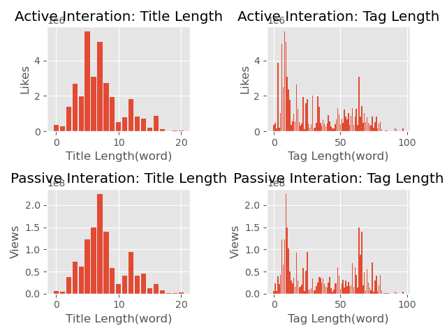

# Pandas EDA Case Study
> Lynx, Dewayne, Max

## Our Goal
_We set out to explore the relationship between naming conventions and popularity._

---
---

## Our Data

We chose to explore Youtube Data!


---
---

## Features
### `title`
* dtype: `string`
### `tags`
* dtype: `string`
### `views`
* dtype: `int`
* used to measure passive popularity
### `likes`
* dtype: `int`
* used to measure interactie popularity
___
___
## `string` Cleaning
### Where we got to

```python
ClnData['title'].str.replace(pat='[^a-z| ]', repl='', regex=True)
```
### Where Lynx had to save Max

```python
.str.replace()

# instead of using:
ClnData['title'].replace()

# and trying to figure this out:

# establish sad list
rem_chars = ["!",'\"',"#","%","&","'","(",")",
            "*","+",",","-",".","/",":",";","<",
            "=",">","?","@","[","\\","]","^","_",
            "`","{","}","~","–","|"]
rep_chars = ['' for i in range(len(rem_chars)-1)]
rep_chars.append(' ')
```

### Missing Data
None missing, party on Garth

---
---

## Findings

